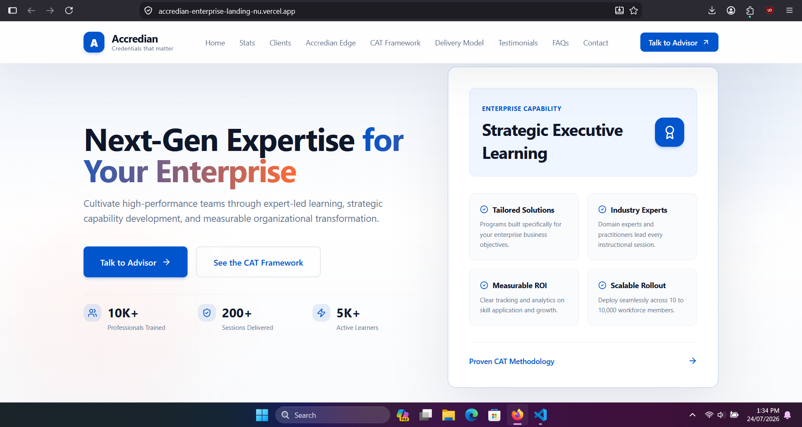
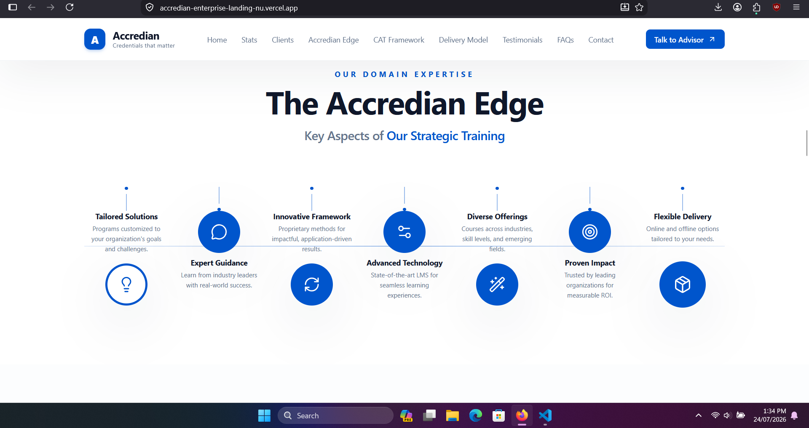
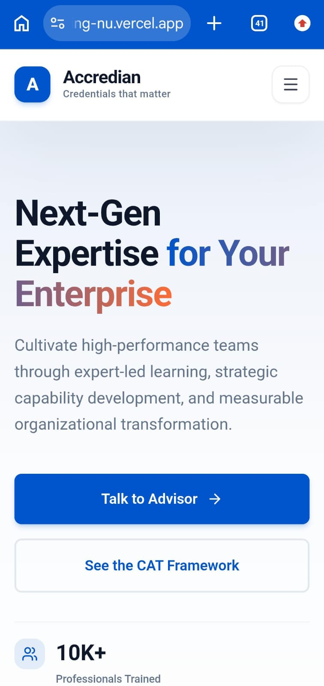
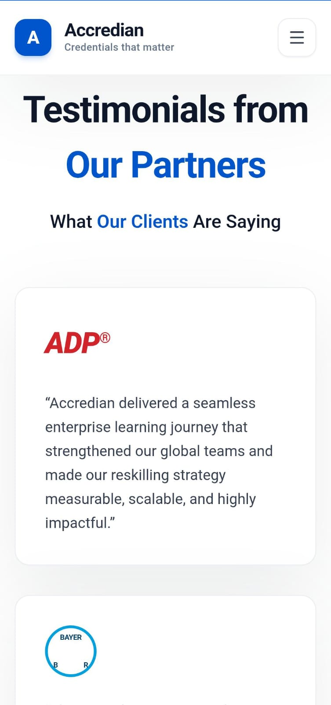

# Accredian Enterprise Landing Page

<p align="left">
  
  
  
  
  
</p>

---

## Objective

This project was developed as part of a Frontend Developer Internship assignment. The objective was to recreate the Accredian Enterprise Landing Page using Next.js while demonstrating responsive design, reusable component architecture, clean code organization, and modern frontend development practices.

---

## Project Overview

**Accredian Enterprise Landing Page** is a responsive recreation inspired by the Accredian Enterprise landing page ([enterprise.accredian.com](https://enterprise.accredian.com/)), built as part of a Frontend Developer Internship assignment. The project demonstrates the ability to translate a real-world production website into a clean, responsive, and performant implementation using modern React and Next.js practices.

The goal of this project was not just to replicate visuals, but to reason through component architecture, responsive behavior, and code organization the way a production frontend team would approach it.

---

## Live Demo

**[https://accredian-enterprise-landing-nu.vercel.app/](https://accredian-enterprise-landing-nu.vercel.app/)**

## GitHub Repository

**[https://github.com/Sjm2006/accredian-enterprise-landing](https://github.com/Sjm2006/accredian-enterprise-landing)**

---

## Screenshots

### Desktop Preview

<p align="center">
  
</p>

<p align="center">
  
</p>

---

### Mobile Preview

<p align="center">
  
  
</p>

---

## Project Highlights

- Built with Next.js 15 App Router
- React 19 + TypeScript
- Tailwind CSS
- Fully Responsive Design
- Reusable Component Architecture
- Lead Capture Form with API Route
- Production Optimized
- Deployed on Vercel

---

## Features

- Fully responsive layout across mobile, tablet, and desktop breakpoints
- Component-driven architecture with reusable, isolated UI blocks
- Built on the Next.js App Router with server and client components used appropriately
- Type-safe codebase using TypeScript throughout
- Utility-first styling with Tailwind CSS for consistent design tokens
- Lightweight iconography using Lucide React
- Lead capture form powered by a Next.js API route
- Optimized for fast load times and clean Lighthouse scores
- Deployed on Vercel with continuous deployment from the main branch

---

## Tech Stack

| Category              | Technology                  | Version   |
|------------------------|------------------------------|-----------|
| Framework              | Next.js (App Router)         | ^15.0.0   |
| UI Library             | React                        | ^19.0.0   |
| Language               | TypeScript                   | ^5.9.0    |
| Styling                | Tailwind CSS                 | ^3.4.0    |
| Icons                  | Lucide React                 | ^1.26.0   |
| Backend / API          | Next.js API Routes           | —         |
| Hosting / Deployment   | Vercel                       | —         |

*Versions reflect the dependencies declared in `package.json`.*

---

## Folder Structure

```
accredian-enterprise-landing/
├── app/                     # Next.js App Router — pages, layouts, and API routes
├── components/               # Reusable and page-specific UI components
├── data/                     # Static/content data used across the site
├── types/                    # TypeScript type definitions
├── public/                   # Static assets (images, icons, fonts)
├── screenshots/               # README preview images (desktop & mobile)
├── .env.example               # Example environment variables
├── .eslintrc.json              # ESLint configuration
├── next-env.d.ts               # Next.js TypeScript environment declarations
├── next.config.js              # Next.js configuration
├── postcss.config.js           # PostCSS configuration
├── tailwind.config.ts          # Tailwind CSS configuration
├── tsconfig.json                # TypeScript configuration
├── package.json
└── README.md
```

---

## Installation & Setup Instructions

Clone the repository and install dependencies:

```bash
git clone https://github.com/Sjm2006/accredian-enterprise-landing.git
cd accredian-enterprise-landing
npm install
```

---

## Running the Development Server

Start the local development server:

```bash
npm run dev
```

The application will be available at:

```
http://localhost:3000
```

---

## Building for Production

Generate an optimized production build:

```bash
npm run build
```

Start the production server locally after building:

```bash
npm run start
```

---

## Deployment

This project is deployed on **Vercel**, which provides native support for Next.js applications.

**Deployment steps:**

1. Push the repository to GitHub.
2. Import the repository into [Vercel](https://vercel.com/).
3. Vercel auto-detects the Next.js framework and configures the build settings.
4. Every push to the main branch triggers an automatic production deployment.

Live deployment: [https://accredian-enterprise-landing-nu.vercel.app/](https://accredian-enterprise-landing-nu.vercel.app/)

---

## Project Architecture and Approach

**Why Next.js App Router**
The App Router was chosen over the Pages Router because it aligns with the current direction of Next.js development, offers native support for React Server Components, and provides better data-fetching patterns and layout nesting. This made it possible to build a more scalable and maintainable page structure while keeping client-side JavaScript minimal where it wasn't needed.

**Why Reusable Components**
The UI was broken down into small, composable components (buttons, cards, section wrappers) rather than large monolithic page files. This reduced duplication, made styling consistent across the site, and made it significantly easier to adjust or extend individual sections without affecting unrelated parts of the layout.

**Project Organization**
The codebase separates concerns clearly: `app/` handles routing, page composition, and API routes; `components/` holds all UI building blocks; `data/` centralizes static content used across sections; and `types/` defines shared TypeScript interfaces. This structure keeps the project predictable and easy to navigate, even as it grows.

**Responsive Design Implementation**
Responsive design was implemented using Tailwind CSS's mobile-first breakpoint system (`sm`, `md`, `lg`, `xl`). Layouts were built starting from the smallest screen size and progressively enhanced for larger viewports, ensuring consistent spacing, typography scaling, and grid behavior across devices.

**Why TypeScript**
TypeScript was used to catch errors at compile time, enforce consistent prop and data shapes across components, and improve overall code readability and maintainability. It also made refactoring safer as the component tree grew in complexity.

---

## AI Usage

In line with the assignment requirements, this section transparently documents where AI tools were used during development:

- **ChatGPT** was used for project planning, debugging assistance, architecture discussions, and clarifying concepts related to Next.js App Router and component design patterns.
- **GitHub Copilot** was used for inline code suggestions and to improve development speed on repetitive or boilerplate code.

All final implementation work — including component structure, UI refinements, responsive styling, layout decisions, manual testing, debugging, and deployment — was completed manually by the developer. AI tools were used as productivity aids, not as a substitute for understanding or hands-on implementation.

---

## Future Improvements

- Backend integration with a database (e.g., PostgreSQL or MongoDB) for dynamic content
- Authentication system for admin or user-specific features
- Enhanced animations and micro-interactions for a more polished feel
- Accessibility improvements (ARIA labels, keyboard navigation, color contrast audits)
- CMS integration (e.g., Sanity or Contentful) for easier content management
- Performance optimization (image optimization, code splitting, caching strategies)
- Unit and integration testing using Jest and React Testing Library

---

## License

This project is licensed under the **MIT License**. You are free to use, modify, and distribute this project with proper attribution.

---

## Author

**Soumyajeet Mondal**

- GitHub: [https://github.com/Sjm2006](https://github.com/Sjm2006)
- LinkedIn: [https://www.linkedin.com/in/soumyajeet2006](https://www.linkedin.com/in/soumyajeet2006)
- Portfolio: [https://sjm2006.github.io/portfolio/](https://sjm2006.github.io/portfolio/)

---

<p align="center"><i>Built as part of a Frontend Developer Internship assignment.</i></p>